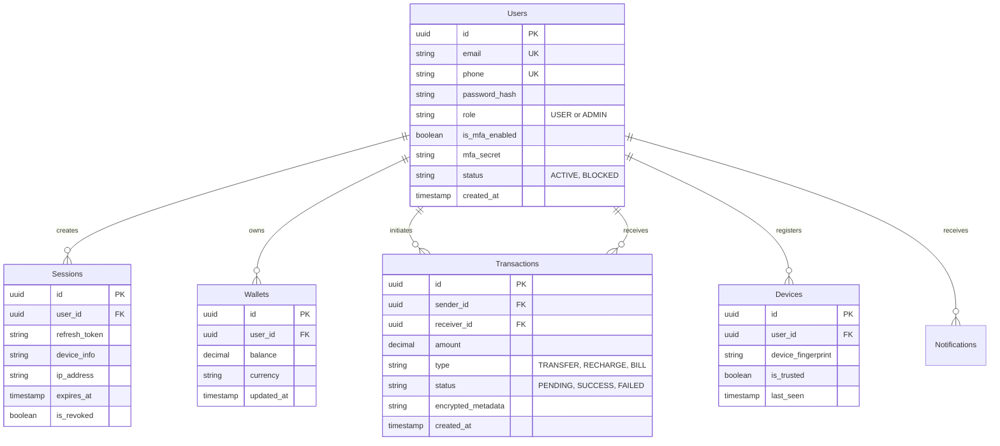

# SecurePay Architecture & Implementation Plan

## 1. System Architecture

SecurePay follows a modern, scalable client-server architecture with a clear separation of concerns.

### Frontend Architecture (React + Vite)
- **State Management**: Redux Toolkit for global state (user session, wallet balance) and RTK Query / Axios for data fetching.
- **UI/UX**: Material UI (M3) layered with custom Framer Motion animations to deliver a premium Google Pay-like experience.
- **Routing**: React Router DOM with protected, public, and admin-only routes.
- **Form Handling**: React Hook Form combined with Zod for robust client-side validation.

### Backend Architecture (Node.js + Express)
- **Pattern**: Controller-Service-Repository (MVC variant) for modularity.
- **API Design**: RESTful APIs versioned under `/api/v1/`.
- **Database**: PostgreSQL (Neon Serverless) for ACID compliance, critical for financial transactions.
- **Security**: Heavily layered middleware (Helmet, Rate Limiters, CORS, CSRF tokens, XSS sanitizers).

### Deployment
- **Frontend**: Vercel (Edge network, auto-scaling).
- **Backend**: Render (Web Service).
- **Database**: Neon (Serverless Postgres).

---

## 2. Database Schema (PostgreSQL)



---

## 3. Folder Structure

```text
SecurePay/
├── frontend/
│   ├── public/
│   ├── src/
│   │   ├── assets/          # Images, icons, animations
│   │   ├── components/      # Reusable UI components (Buttons, Cards)
│   │   ├── hooks/           # Custom React hooks
│   │   ├── layouts/         # App layouts (AuthLayout, MainLayout)
│   │   ├── pages/           # Route components (Home, Login, Transfer)
│   │   ├── routes/          # Route definitions and guards
│   │   ├── services/        # API integration (Axios instances)
│   │   ├── store/           # Redux slices and store config
│   │   ├── theme/           # MUI theme config (M3), colors, typography
│   │   └── utils/           # Helpers, formatters, constants
│   ├── index.html
│   └── vite.config.ts
│
└── backend/
    ├── src/
    │   ├── config/          # Environment, DB, and 3rd-party configs
    │   ├── controllers/     # Route handlers
    │   ├── middleware/      # Auth, security, error handling
    │   ├── models/          # DB schemas / queries (Prisma or PG)
    │   ├── routes/          # API route definitions
    │   ├── services/        # Business logic (crypto, payment processing)
    │   ├── utils/           # Helpers, crypto utils, logger
    │   └── validators/      # Zod schemas for request validation
    ├── .env
    └── server.ts
```

---

## 4. Security Architecture

SecurePay implements a Zero-Trust, Defense-in-Depth approach:

### Authentication & Authorization
- **JWT & Refresh Tokens**: Short-lived access tokens (15m) and HTTP-only, secure refresh tokens.
- **MFA**: Time-based One-Time Passwords (TOTP) / Email OTP for high-value actions and login.
- **RBAC**: Strict role checks (`USER`, `ADMIN`) on API endpoints.

### Data Protection
- **Encryption at Rest & Transit**: TLS 1.3 for all communications.
- **AES-256-GCM**: Used to encrypt sensitive transaction metadata before DB insertion.
- **Argon2 / bcrypt**: Strong hashing for passwords with a high work factor.

### Threat Mitigation
- **Rate Limiting & Throttling**: Strict limits on `/login`, `/transfer`, and `/otp` endpoints to prevent brute-forcing.
- **Device Fingerprinting**: Anomalous login detection based on new IPs or unrecognized devices.
- **XSS & CSRF**: Sanitization of all inputs via `xss-clean` and strict validation via `Zod`. CSRF tokens for sensitive state-changing operations.
- **SQL Injection**: Use of parameterized queries / ORM to eliminate injection risks.

---

## 5. Development Execution Plan

- **Phase 1 (Current)**: Setup monorepo architecture, initialize React + Vite (Frontend) and Express (Backend). Configure Database connection and basic Auth flow.
- **Phase 2**: Implement core wallet and payment transaction logic with AES encryption and concurrent transaction handling.
- **Phase 3**: Develop Admin dashboard, analytics, and fraud detection logic.
- **Phase 4**: UI/UX polish (Framer Motion, M3 design system), extensive testing, and deployment to Vercel/Render.
